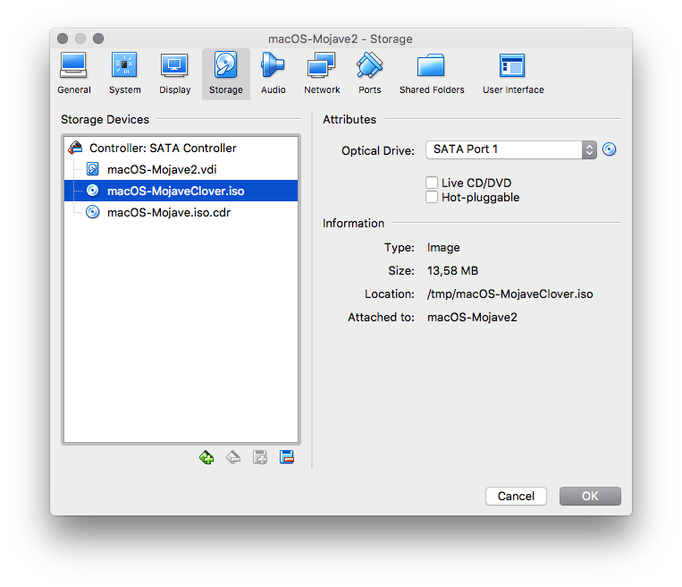
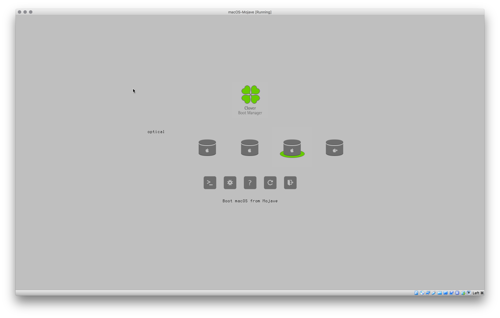
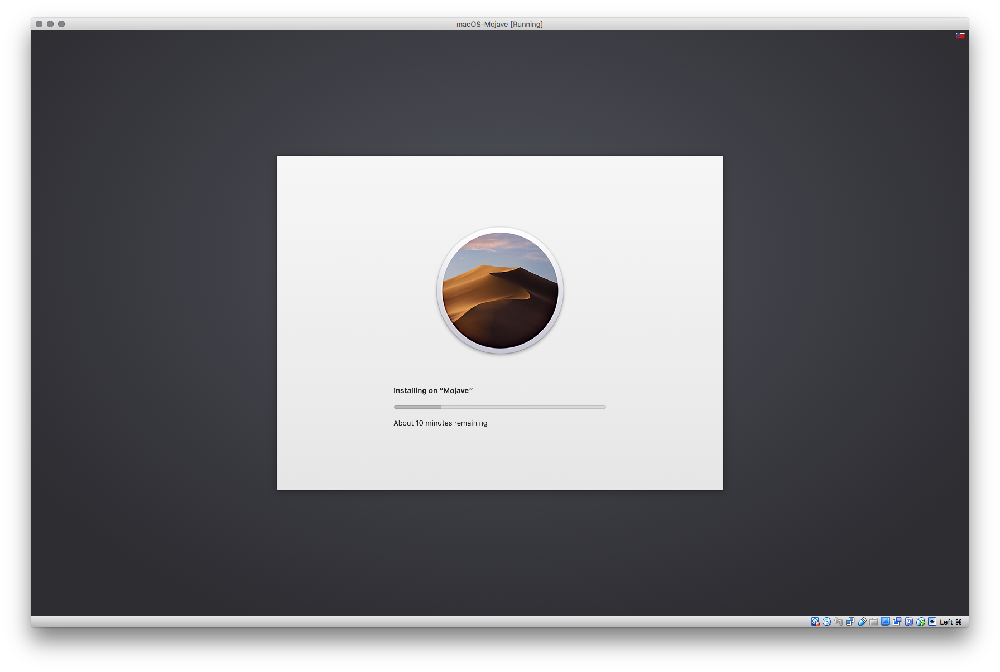

# Run macOS 10.14 Mojave on VirtualBox

## Overview

Simple script to automatically install and run macOS 10.14 Mojave on VirtualBox. Since VirtualBox 5.2 does not support booting from APFS volumes, this script is using the [Clover EFI bootloader](https://sourceforge.net/projects/cloverefiboot/) as a workaround.

## ToC

 * [Quick Guide](#quick-guide)
 * [Step by Step Guide](#step-by-step-guide)
 * [FAQ](#faq)

##  Quick Guide

Execute ```make image``` to setup and run everything:

```
$ make image
Setup takes around 2 minutes...
Running checks...
Creating image '/tmp/macOS-Mojave.dmg' (will need sudo)...already exists.
Creating iso '/tmp/macOS-Mojave.iso.cdr'...already exists.
Creating clover image '/tmp/macOS-MojaveClover.iso'...already exists.
Creating VM HDD '/Users/me/VirtualBox VMs/macOS-Mojave/macOS-Mojave.vdi'...already exists.
Creating VM 'macOS-Mojave'...already exists.
Starting VM 'macOS-Mojave'...already running.
```

Execute ```make``` to get some help:

```
$ make
Some available commands:
 * image    : create macOS installer image, clover boot image, VM and disk
 * clean    : delete generated images and downloaded files
 * stash    : delete generated VM and disk
 * test     : test shell scripts
 * style    : style shell scripts
 * harden   : harden shell scripts
 * feedback : create a GitHub issue
```
 
## Step by Step Guide

1. After executing ```make image``` you should have a configured VM:

2. After booting erase the virtual drive ```VBOX HARDDISK Media``` in Disk Utility using APFS and name it 'Mojave':

3. Install macOS on the erased virtual drive 'Mojave' (around 4 minutes):

4. After the reboot switch off the VM and remove ```macOS-Mojave.iso.cdr``` and restart:

5. Start macOS in the Clover boot menu (the initial installation might take some time):


6. Enjoy macOS Mojave in Virtualbox:


## FAQ

* Reboot
  * Q: I see the message ```MACH Reboot```. What should I do?
  * A: The VM just starts to restart. Restart manually.
* Installation Loop
  * Q: After starting the installation the VM restarts and I see the installer again.
  * A: Switch off the VM and go to step 4.
* Kernel Panic
  * Q: I see the message ```Error loading kernel cache (0x9)```. What should I do?
  * A: Restart the VM. This error is shown from time to time.
